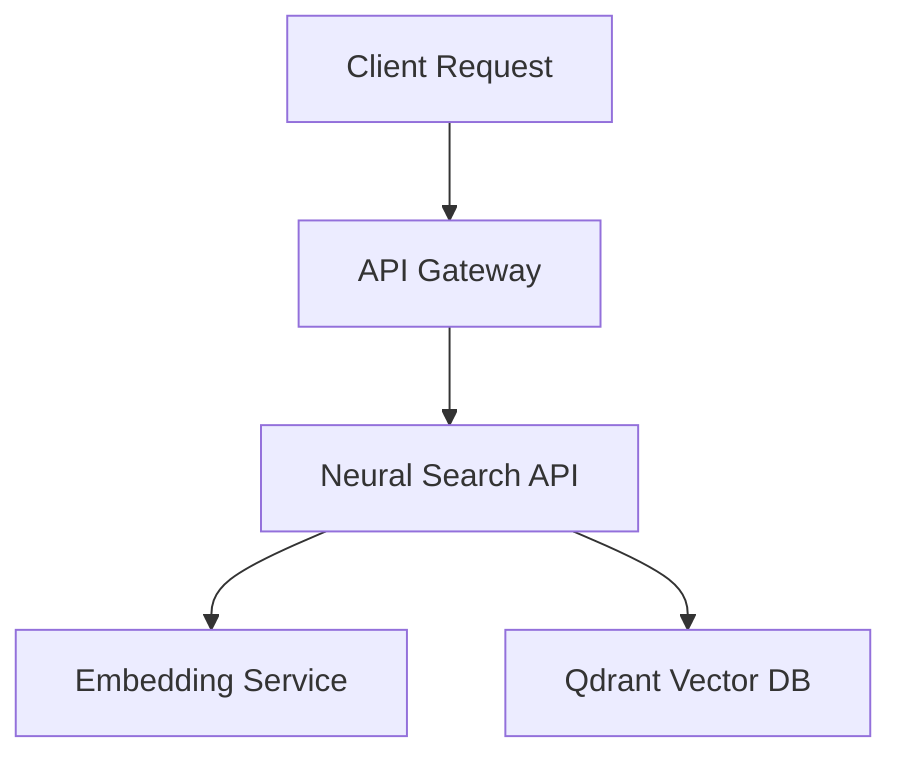

This is an example documentation page representing how future project technical references should be structured. It serves as a visual guide and template for your other projects.

## Overview

The Neural Search service provides vector-based semantic search capabilities over large text corpora using pre-trained transformer embeddings.



---

## API Endpoints

### 1. Generate Embeddings

`POST /api/v1/embeddings`

Generates dense vector embeddings for the provided input text.

#### Request Schema
```json
{
  "text": "What is agentic workflows?",
  "model": "text-embedding-3-small"
}
```

#### Response Schema
```json
{
  "embedding": [0.012, -0.043, 0.923, "... 1536 dimensions"],
  "tokens_used": 6
}
```

### 2. Query Search

`POST /api/v1/search`

Performs a cosine-similarity nearest-neighbor search.

| Parameter | Type | Required | Description |
| :--- | :--- | :--- | :--- |
| `query` | `string` | Yes | The natural language search query. |
| `top_k` | `number` | No | Number of matches to return (default: `5`). |
| `threshold` | `number` | No | Minimum similarity score (default: `0.7`). |

---

## Formatting Cheat Sheet

When adding documentation for new projects, you can use these Markdown elements:

> **Note on Styling:** Headers (`h2`, `h3`), blockquotes, code blocks, lists, and tables are fully styled automatically by the `@tailwindcss/typography` theme configured in `LayoutDoc.astro`.

### Callouts (Blockquotes)
> [!NOTE]
> Use callouts to highlight important guidelines, setup caveats, or API credentials.

### Code Highlighting
Use standard markdown syntax with language tags (e.g. `python`, `typescript`, `bash`) for syntax-colored code blocks.
